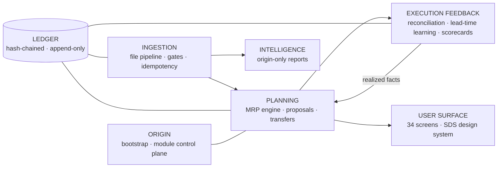

# Sentinel

> Multi-tenant supply-chain **planning, sourcing and intelligence** layer that sits on top of Precoro —
> the system of record. Precoro executes; Sentinel plans, approves and verifies.

[](./.github/workflows/ci.yml)


---

## What Sentinel is

Sentinel turns daily file drops (Precoro exports plus an external deliveries extract) into a
planning platform: a verified MRP engine, order proposals, inter-tenant transfer planning with
automatic reconciliation, supplier scorecards, savings tracking, a hash-chained append-only ledger
and a per-tenant KPI surface — all governed by a strict execution boundary:

| Concern | Where it happens |
|---|---|
| Physical execution (POs, receipts, transfers, adjustments, dispositions) | **Precoro** |
| Planning, proposals, approvals-before-execution, reconciliation, measurement | **Sentinel** |
| Data flow | File-based, pull-only, **no Precoro write-back — enforced by CI grep gate** |

## Non-negotiables

1. **TDD always** — no production code without a test that failed first.
2. **Engine formulas are byte-compatible** with the company's verified workbook — guarded by 86
   golden tests (plus 25 calendar/dates + supply producers) that must never change intent; the
   structural battery beyond the golden core (matching, scorecards, efficacy, governance, ledger,
   auth, DR, doors, workers) adds 1,000+ more assertions per push.
3. **`packages/core` is pure** — no DB, no React, no framework imports. Unit-testable in isolation.
4. **No Precoro write-back anywhere.** Order proposals leave as PDF/file only.
5. **No credential literals.** Every secret comes from the environment / secret manager.
6. **No client-identifying names and no production data in the repo.** Enforced by
   `scripts/guards/forbidden-terms.sh` in CI. Fixtures are synthetic or explicitly redacted.
7. **Everything is a module.** Capability is added, upgraded, paused or removed as a plugin with a
   `sentinel.module.json` manifest — one module breaking must never affect anything else.

## Architecture (five nodes on one data spine)



- **Planning engine** — decoded verbatim from the verified workbook; deliveries are the only raw
  demand primitive; consumption, cover, run-out, EOQ and reorder all derive from a per-SKU
  consumption-per-delivery rate. The workbook's verified inconsistencies are detected and named
  beside the ladder (`LADDER_DEAD_BRANCH_7`, `REORDER_DISPLAY_TRIGGER_BAND`, `NEGATIVE_AVAILABLE`),
  never silently fixed.
- **Execution feedback** — the loop of record: `PROPOSAL → DECISION → COMMITMENT (PO) → RECEIPT`,
  receipt→PO-line matching under normative rules (splits, amendments, cancellations, returns, merges),
  the H2 scorecard with BOTH due arms (what arrived; what was promised and never arrived), efficacy
  signals, realized savings, double-order guard.
- **Controls** — the C3 decision layer (SoD spine, tiers, dual control), supplier-identity freeze,
  versioned conversion-factor governance decided through the §14.13c API, the M10 FX fail-safe with
  the pinned rate honestly aged, and the H5 hash-chained ledger — every Class-W/A/N/S/D write one
  tamper-evident block, every machine write stamped `ENGINE_VERSION`/`SCHEMA_VERSION` (L-07).
- **Operations** — the M9 freshness SLO + missing-deliveries alarm, the §14.6g data-health sweep
  (a disclosed gap becomes a register row; a fixed gap resolves, never deletes), and the H11
  restore-rehearsal gate (RPO 15 / RTO 240 as frozen policy data; the restore path rehearsed on
  every CI push).
- **Module control plane** — registry + manifests + lifecycle
  (`REGISTERED → ENABLED ⇄ DISABLED` plus `PAUSED` and `FAULTED`); Origin manages it on screen 33
  (build spec §14.15). Adding capability = adding a module, never core surgery.

## Module registry

Core modules (pure, manifest-carried, `packages/core/modules/…`):

| Module | Version | Provides |
|---|---|---|
| `planning-engine` | 1.2.0 | MRP board logic, proposals, cover/run-out, the status ladder + edge warnings, supply-status producers |
| `execution-feedback` | 1.4.0 | matching canon, scorecards (H2 second arm + rebuild), efficacy, savings, double-order guard |
| `ingestion` | 0.3.0 | strict parse, file binding, H8 window alignment, FX fail-safe inputs, H6 idempotency keys, PO-status normalization |
| `kpi-catalog` | 0.4.0 | screen-34 KPI definitions as data + the dataState envelope |
| `calendar` | 0.3.0 | the H4 canonical date boundary + H9 working calendars |
| `approval` | 0.2.0 | the C3 decision layer, supplier freeze, M7 CF governance |
| `ledger` | 0.1.0 | RFC 8785 canonicalization, the §16.2 gate, the keyed hash chain |
| `auth` | 0.1.0 | sessions, TOTP (RFC 6238), lockout, the mfa gate |
| `ops` | 0.5.0 | freshness SLO, FX staleness alarm, the §14.6g data-health sweep derivation |
| `intelligence` | 0.1.0 | the egress allow-list + prompt-injection stance (policy data + verdicts) |
| `dr` | 0.1.0 | the restore-rehearsal verdict layer (evaluateRehearsal/Restore/Archiving, closeGate) |

Services & infrastructure:

| Package | Provides |
|---|---|
| `packages/plan-service` | the engine-live run boundary: seals, replay, restatement, the §14.6g sweep wiring |
| `packages/procure-service` | the §14.13c CF decide/apply API (gate → Class-D record → freeze door) |
| `packages/ingest-service` | the file-to-rows worker: H10 gate → text decode or §4.1 workbook extraction → parse → convert → idempotent apply |
| `packages/db` | migrations + RLS (0001–0009), the plan/procure/ledger/auth/fx/scorecard/data-health adapters |
| `packages/ui` | the vendored shadcn primitives + the SDS token theme |
| `apps/web` | Next.js 15 app router: auth, plan, data-health, the §14.13c approvals tray + API route, the /audit time machine, the SRC-05 suppliers tile, /health (the L-07 stamp + the image probe target) |

## Repository layout

```
sentinel/
├─ apps/
│  └─ web/                # Next.js 15 app router (auth, plan, data-health, approvals APIs)
├─ packages/
│  ├─ core/               # PURE domain — no db, no framework, no io (checked in CI)
│  │  └─ modules/         # one subpackage per build spec §14.15 (registry above)
│  ├─ plan-service/       # the engine-live run boundary (seals, replay, restatement, sweep)
│  ├─ procure-service/    # the §14.13c CF decide/apply API
│  ├─ ingest-service/     # the file-to-rows worker (H10 gate → idempotent apply)
│  ├─ db/                 # migrations + RLS + the SQL adapters (plan/procure/ledger/auth/fx/…)
│  └─ ui/                 # vendored primitives + the SDS token theme
├─ docs/
│  ├─ spec/               # THE CONTRACT: build, delivery, ingestion, design specs (sanitized)
│  ├─ design/             # design handoff: final tokens, shell, 35-screen intent + prototypes
│  ├─ atlas/              # User Workflow Atlas (W-01…W-16 + glossary + appendices)
│  ├─ adr/                # architecture decision records (MADR)
│  ├─ milestones/         # the exit reviews of record (M1…M4)
│  └─ templates/          # the sanitized ingestion workbook template
├─ fixtures/golden/       # synthetic / redacted extracts + checksums
├─ scripts/
│  ├─ guards/             # forbidden terms, SDS parity, ui scope, status vocabulary
│  ├─ security/           # the M12 gate proofs (audit, gitleaks, licence, SBOM, pinning, egress)
│  ├─ build/              # the §14.23 image-gate proof (the Dockerfile contract, machine-checked)
│  ├─ e2e/                # the §14.24 e2e-smoke: compose.yaml consumer, prepare + smoke scripts, the named proof
│  └─ dr/                 # the H11 restore-rehearsal staging harness
└─ .github/workflows/     # CI: 9 merge-blocking jobs
```

## Getting started

```bash
# prerequisites: Node.js ≥ 22 (core modules are zero-dependency)
git clone https://github.com/atqatq/sentinel && cd sentinel

npm run test        # the structural battery (1,304) must pass — every suite green,
                    # including the §14.22 scale gate (p95 < 500 ms at 4,200 refs)
npm run guard       # forbidden terms, SDS parity, ui scope, status binding — must always be clean

# the live tier (RLS matrix, seals, ledger, auth, DR restore, sweeps) runs in CI on postgres 16
```

## Testing philosophy

- **Golden-first.** The engine was decoded cell-by-cell from the verified workbook; its formulas are
  guarded by golden tests. Changing a formula requires changing a golden test *deliberately*, never
  incidentally.
- **Port, don't re-derive.** `planning-engine` and `execution-feedback` are ports of pre-verified
  modules — zero logic edits during migration.
- **Purity gate.** `packages/core` must never import a framework, ORM or IO library; the import
  boundary is checked in CI.

## Data governance

- No client brand names, person names, supplier names, or production extracts are ever committed.
- The guard script fails CI on forbidden terms and secret-shaped strings.
- The ingestion workbook template ships sanitized; real files stay out of band.
- Specs in `docs/spec/` are the sanitized contract — they describe schemas and shapes, never rows.

## Roadmap (delivery-spec §6.3 — where we are)

| Milestone | Version | State |
|---|---|---|
| **M0** Foundations | `0.1.0` | ✅ shipped |
| **M1** Data foundation | `0.2.0` | ✅ shipped |
| **M2** Planning online | `0.3.0` | ✅ shipped |
| **M3** SOURCE & controls | `0.4.0` | ✅ shipped |
| **M4** Closed loop | `0.5.0` | ✅ shipped (exit review: `docs/milestones/M4-EXIT-REVIEW.md`) |
| **M5** Hardening & release | `0.6.0 → 1.0.0-rc.N` | 🚧 in progress — M12 security gates + SBOM ✅, M13 egress allow-list ✅, M14 ladder-edge warnings ✅, H11 DR machinery ✅, the H2 second arm ✅, the data-health sweep ✅, the CF decide/apply API ✅, the §14.22 perf/load gate ✅ (p95 4,596 → 243 ms at 4,200 refs), the §4.1 XLSX reader behind H10 ✅ (real exact-pinned reader in the worker layer), the Mode-B per-kind fan-out ✅ (the combined 8-tab template workbook fans out — one H6 register row per kind under the file's checksum, per-kind replay, the named edges MULTI_SHEET_KIND_COLLISION / WORKBOOK_NO_DATA_ROWS, the file's verdict aggregated honestly, one fence per FILE; the §1 promise "Both produce identical results" kept), the §14.13c approvals tray ✅ (the gate's queue on screen, decide actions riding the API, the gate's refusals verbatim), screen 12 /audit ✅ (the audit chain table reading the H5 ledger + the time machine re-deriving snapshots from sealed payloads only), the SRC-05 suppliers tile ✅ (single-source exposure, envelope rendered verbatim), the §14.23 image build + Trivy container scan ✅ (`sentinel-web`: multi-stage distroless nonroot, bases digest-pinned, Trivy fail-closed HIGH+CRITICAL, image SBOM attached), the §14.24 e2e-smoke ✅ (the ephemeral compose stack: digest-pinned postgres 16, real migrations, BOTH service roles (`sentinel_web` + `sentinel_worker`, the deployment shape), the fence's TENANT/FRESHNESS honest states walked over HTTP on the real image, and the clause-13 WALK — the golden suppliers fixture dropped into the worker's bind-mounted inbox, settled `done/` in the container on the real database, the register read back through the write's own fence, and the REPLAY proven idempotent live — the browser-level happy paths ride staging), the §14.25 worker runtime ✅ (the watched-folder poll loop daemon — the ADR-0002 fence per file, the atomic claim, the exhaustive outcome folders, poison isolation — and the `sentinel-worker` image built and scanned beside `sentinel-web` under one gate and one waiver set; the BullMQ queue transport arrives with its producer), the §14.27 freeze-ingestion auto-staging ✅ (D-029's named follow-on discharged: the supplier file routes identity deltas into holds — the executor classifies before it writes, the unstated-is-not-a-proposal rule coalesces omitted frozen fields to the stored value in BOTH the classifier and the write, a frozen delta takes the REDUCED upsert while the delta AUTO-STAGES a COOLING_OFF hold through the procure door with requestedBy NULL, one open hold per supplier — the identical re-drop dedupes, a divergent delta stages NOTHING and names both deltas — and the holds receipt {staged, deduped, diverged, tasks} rides the run's disclosures); remaining: pen-test fixes (external coordination), the distroless digest bump (retires the six CVE waivers when upstream rebuilds) |
| **Setup & onboarding** | `0.12.0` | 🚧 in progress — the §14.28 contract written (the setup doors: the origin bootstrap script, the founder SECURITY DEFINER door, `must_change`, the wizard commands riding the existing RLS, the Origin-only upload seam over the worker's own pipeline, the `/setup` screens; D-049); implementation units land next |
| Parallel run | `1.0.0` | ⏳ external — cutover W1–W13 + the ≥ 4-week parallel run (gates 19–20) |

## Docs map

| Read | For |
|---|---|
| `docs/spec/SENTINEL_V3_BUILD_SPEC.md` | the contract — screens, logic, data model, DoD |
| `docs/spec/SENTINEL_V1_DELIVERY_SPEC.md` | how this repo gets built: stack, TDD, CI, versioning |
| `docs/spec/INGESTION_FILE_SPEC.md` | which files arrive, allow-lists, validation gates |
| `docs/spec/SENTINEL_DESIGN_SPEC.md` | the SDS design brief (superseded on visual detail by the handoff below) |
| `docs/design/README.md` | the design handoff — final tokens, shell, and all 35 screens' intent |
| `docs/design/prototypes/` | sanitized design references (app, foundations, components) — visual truth, not code to copy |
| `docs/atlas/Sentinel_User_Workflow_Atlas.html` | every user workflow W-01…W-16 + glossary |
| `docs/ARCHITECTURE.md` + `docs/adr/` | how the codebase is shaped and why |
| `CONTRIBUTING.md` | the micro-commit convention |
