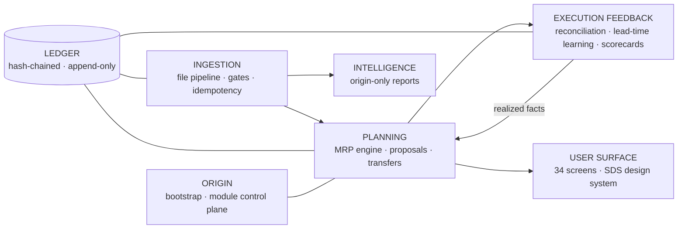

# Sentinel

> Multi-tenant supply-chain **planning, sourcing and intelligence** layer that sits on top of Precoro —
> the system of record. Precoro executes; Sentinel plans, approves and verifies.

[](./.github/workflows/ci.yml)


---

## What Sentinel is

Sentinel turns daily file drops (Precoro exports plus an external deliveries extract) into a
planning platform: a verified MRP engine, order proposals, inter-tenant transfer planning with
automatic reconciliation, supplier scorecards, savings tracking, a hash-chained append-only ledger
and a per-tenant KPI surface — all governed by a strict execution boundary:

| Concern | Where it happens |
|---|---|
| Physical execution (POs, receipts, transfers, adjustments, dispositions) | **Precoro** |
| Planning, proposals, approvals-before-execution, reconciliation, measurement | **Sentinel** |
| Data flow | File-based, pull-only, **no Precoro write-back — enforced by CI grep gate** |

## Non-negotiables

1. **TDD always** — no production code without a test that failed first.
2. **Engine formulas are byte-compatible** with the company's verified workbook — guarded by 117
   golden tests (86 engine + 31 feedback) that must never change intent.
3. **`packages/core` is pure** — no DB, no React, no framework imports. Unit-testable in isolation.
4. **No Precoro write-back anywhere.** Order proposals leave as PDF/file only.
5. **No credential literals.** Every secret comes from the environment / secret manager.
6. **No client-identifying names and no production data in the repo.** Enforced by
   `scripts/guards/forbidden-terms.sh` in CI. Fixtures are synthetic or explicitly redacted.
7. **Everything is a module.** Capability is added, upgraded, paused or removed as a plugin with a
   `sentinel.module.json` manifest — one module breaking must never affect anything else.

## Architecture (five nodes on one data spine)



- **Planning engine** — decoded verbatim from the verified workbook; deliveries are the only raw
  demand primitive; consumption, cover, run-out, EOQ and reorder all derive from a per-SKU
  consumption-per-delivery rate.
- **Execution feedback** — the loop of record: `PROPOSAL → DECISION → COMMITMENT (PO) → RECEIPT`,
  reconciliation of transfer plans against ingested goods-in/out (`RECONCILED | MISMATCH`),
  lead-time learning, supplier scorecards, realized savings, double-order guard.
- **Module control plane** — registry + manifests + lifecycle
  (`REGISTERED → ENABLED ⇄ DISABLED` plus `PAUSED` and `FAULTED`); Origin manages it on screen 33
  (build spec §14.15). Adding capability = adding a module, never core surgery.

## Module registry

| Module | Package | Status | Provides |
|---|---|---|---|
| `planning-engine` | `packages/core/modules/planning-engine` | ✅ ported verbatim, 86 golden tests green | MRP board logic, proposals, cover/run-out, EOQ |
| `execution-feedback` | `packages/core/modules/execution-feedback` | ✅ ported verbatim, 31 tests green | reconciliation, learning, scorecards, savings, guards |
| `ingestion` | `packages/ingestion` | 🔜 M1 | file detection, validation gates, idempotency keys |
| `kpi-catalog` | `packages/kpi` | 🔜 M4 | screen-34 KPI definitions as data + evaluators |
| `ledger` | `packages/db` | 🔜 M1 | hash-chained append-only store, RFC 8785 canonicalization |
| `web` | `apps/web` | 🔜 M2 | Next.js 15 + SDS UI, 34 screens |

## Repository layout

```
sentinel/
├─ apps/                  # web (Next.js 15), worker (BullMQ) — milestone M2+
├─ packages/
│  ├─ core/               # PURE domain. modules/ subpackage per build spec §14.15
│  │  └─ modules/
│  │     ├─ planning-engine/       # sentinel.module.json + src + golden tests
│  │     └─ execution-feedback/    # sentinel.module.json + src + tests
│  ├─ db/                 # Prisma schema, migrations, RLS policies — M1+
│  ├─ ui/                 # vendored component library + SDS theme — M2+
│  ├─ contracts/          # Zod schemas shared by FE/BE/worker — M1+
│  └─ config/             # tsconfig / eslint / vitest presets — M1+
├─ docs/
│  ├─ spec/               # THE CONTRACT: build, delivery, ingestion, design specs (sanitized)
│  ├─ atlas/              # User Workflow Atlas (W-01…W-16 + glossary + appendices)
│  ├─ adr/                # architecture decision records (MADR)
│  └─ ingest-contracts/   # one page per inbound report — M1+
├─ fixtures/golden/       # synthetic / redacted extracts + checksums — M1+
├─ scripts/guards/        # CI guard: forbidden terms + secret patterns
└─ .github/workflows/     # CI pipeline
```

## Getting started

```bash
# prerequisites: Node.js ≥ 22 (no package install needed — core is zero-dependency)
git clone https://github.com/atqatq/sentinel && cd sentinel

npm run test        # 117 golden tests must pass: 86 engine + 31 feedback
npm run guard       # forbidden-term & secret scan — must always be clean
```

## Testing philosophy

- **Golden-first.** The engine was decoded cell-by-cell from the verified workbook; its formulas are
  guarded by golden tests. Changing a formula requires changing a golden test *deliberately*, never
  incidentally.
- **Port, don't re-derive.** `planning-engine` and `execution-feedback` are ports of pre-verified
  modules — zero logic edits during migration.
- **Purity gate.** `packages/core` must never import a framework, ORM or IO library; the import
  boundary is checked in CI.

## Data governance

- No client brand names, person names, supplier names, or production extracts are ever committed.
- The guard script fails CI on forbidden terms and secret-shaped strings.
- The ingestion workbook template ships sanitized; real files stay out of band.
- Specs in `docs/spec/` are the sanitized contract — they describe schemas and shapes, never rows.

## Roadmap (delivery-spec milestones)

| Milestone | Scope |
|---|---|
| **M0** | repo, docs, CI, guards, verbatim core port (this commit set) |
| **M1** | ingestion pipeline, Prisma schema + RLS, ledger |
| **M2** | web shell + SDS, MRP board, planning screens |
| **M3** | execution feedback, transfers + reconciliation UI |
| **M4** | analytics, per-tenant KPI dashboard (screen 34), Atlas-linked workflows |
| **M5** | hardening, E2E suite, versioned release `1.0.0` |

## Docs map

| Read | For |
|---|---|
| `docs/spec/SENTINEL_V3_BUILD_SPEC.md` | the contract — screens, logic, data model, DoD |
| `docs/spec/SENTINEL_V1_DELIVERY_SPEC.md` | how this repo gets built: stack, TDD, CI, versioning |
| `docs/spec/INGESTION_FILE_SPEC.md` | which files arrive, allow-lists, validation gates |
| `docs/spec/SENTINEL_DESIGN_SPEC.md` | the SDS design system |
| `docs/atlas/Sentinel_User_Workflow_Atlas.html` | every user workflow W-01…W-16 + glossary |
| `docs/ARCHITECTURE.md` + `docs/adr/` | how the codebase is shaped and why |
| `CONTRIBUTING.md` | the micro-commit convention |
